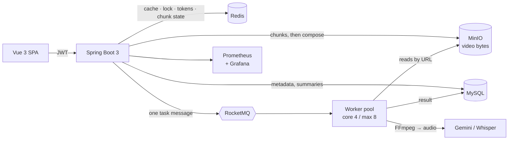

<div align="center">

# DoVideoAI

**Upload a video, get an AI summary and a timestamped transcript.**

Resumable chunked uploads · asynchronous AI processing · content deduplication · instrumented end to end

<a href="https://github.com/Mingxin-Rao/Ai-intelligence-video-platform/actions/workflows/ci.yml">
  
</a>


</div>

## What this is

A video understanding platform: sign in, upload a file or paste a link, and get an
AI-generated summary plus a timestamped transcript.

The interesting engineering is not the AI call — it is everything around it. A
5-minute video costs about **12 seconds** of FFmpeg extraction plus model inference,
so that work cannot happen on an HTTP request. Multi-gigabyte uploads cannot depend
on one connection surviving the whole transfer. And the same video uploaded twice
must not cost two paid model calls.

**Every performance number below is measured, with the commands and raw output in
[loadtest/RESULTS.md](loadtest/RESULTS.md)** — including the two cases where
measuring contradicted what I had assumed.

---

## Measured results

| | Result | How |
|---|---|---|
| **Video-processing request latency** | **12.3 s → ~80 ms** | Same 5-min 720p input. Async RT by `curl`; the synchronous cost is the service's own `dovideo.ai.task` timer (FFmpeg + provider + persist) |
| **Large-file upload on a degraded link** | **0% → 100%** success | Toxiproxy severing any connection past 8 MiB; 20 MB payload, 5 MiB chunks, identical 4-attempt retry budget on both arms |
| **Duplicate upload** | **682 ms → 11 ms** (~63×) | 1 upload + 19 identical repeats; 19/19 deduped, each also avoiding a paid model call |
| **Polling read path** | **p50 10.5 ms**, p95 86.2 ms, **0 failures** / 765 requests | k6, ramp to 50 VUs, 3 s think time matching the real client poll |
| **Cache hit rate** | **99.87%** (762 hits / 1 miss) | Read from the app's own meters after the run above |
| **Tests** | **120 passing**, ~14 s, no middleware needed | JUnit 5 + Mockito + MockWebServer |
| **Coverage** | **76.1%** instruction, 64.6% branch | JaCoCo, enforced as a CI gate |

Two claims were deliberately **removed** rather than restated: an earlier `~60 s`
synchronous baseline did not reproduce (12.3 s is the measured figure), and a
`25% → 99% under 20% packet loss` upload claim described a test that was never run.

---

## Architecture

Three storage layers, each holding what the others are bad at, and one asynchronous
boundary that keeps slow work off the request path.



| Layer | Holds | Why not elsewhere |
|---|---|---|
| **MySQL** | users, media rows, summaries, transcripts, dedup keys | Relational data needing ACID, unique constraints and indexed reads |
| **MinIO** | video bytes, and staged upload chunks | Blobs in MySQL wreck backups and pull whole files through the heap; local disk dies with the container |
| **Redis** | list cache · distributed lock · rate-limit tokens · chunk progress | Four kinds of state that are hot, small, and either disposable or cross-process |
| **RocketMQ** | one message per analysis task | A durable hand-off, so the request thread is freed and a crash loses no work |
| **Prometheus / Grafana** | 12 business meters, 7 alert rules | Once work leaves the request, a failing worker looks like a healthy server |

### Redis is doing four different jobs

Not "caching" — four problems, four data structures:

| Role | Key | Structure | The property that made it right |
|---|---|---|---|
| List cache | `media:list:user:{uid}` | String (JSON) | Sub-ms reads for a 3 s polling loop; invalidated on every write, not just by TTL |
| Distributed lock | `lock:analyze:{id}` | Redisson lock + watchdog | Mutual exclusion **across processes** — a JVM lock guards one instance |
| Rate limiter | `limit:ai:global` | Token bucket, `OVERALL` | A cluster-wide cap, so the API bill is bounded regardless of instance count |
| Chunk progress | `upload:chunks:{uid}:{md5}` | **Set** | **Idempotent insertion** — a weak link is exactly when a client re-sends a chunk it already delivered |

### Resumable upload

```
init  ─ ask what is missing         → INSTANT (already own it) | RESUME + missingChunks
chunk ─ stage part i                → MinIO tmp/{md5}/{i}, then SADD i
        a failed chunk deliberately does NOT record its index, so init still reports the gap
merge ─ verify the set is complete  → INCOMPLETE (refuses to compose) | composeObject server-side
        chunks and Redis key are dropped only after the merged object exists
```

The whole-file MD5 is computed **incrementally in the browser** over the same 5 MiB
slices, so a multi-gigabyte file never enters memory. The key is derived from
content rather than a session, so an upload resumes across a page reload.

Chunk size is 5 MiB because that is MinIO's floor for server-side compose — which is
what keeps a 2 GB merge from costing the application any memory or bandwidth.

### Deduplication uses a different key per ingestion path

- **File uploads** key on the **content MD5**: the bytes are the identity.
- **Link imports** key on the **upstream video id** (`youtube:xxx`): the same video
  has many URL forms, and re-encoding changes the bytes — so a content hash is the
  wrong key here. Resolving the id is a metadata-only call, so a duplicate link is
  rejected **before downloading anything**.

---

## Tech stack

**Backend** — Java 17 · Spring Boot 3 · Undertow · MyBatis-Plus · MySQL 8 · Redis + Redisson · RocketMQ 4.9 · MinIO · FFmpeg · yt-dlp
**AI** — Gemini (summaries) · OpenAI Whisper (transcripts), behind a strategy interface
**Frontend** — Vue 3 · Vite · SparkMD5
**Ops** — Docker multi-stage · Docker Compose · GitHub Actions · Prometheus · Grafana · Micrometer
**Testing** — JUnit 5 · Mockito · OkHttp MockWebServer · JaCoCo · k6 · Toxiproxy

---

## Run it

Everything runs in Docker, including the application. Requires Docker Desktop.

### 1. Secrets

```bash
cp .env.example .env
```

| Variable | Required | Notes |
| :--- | :--- | :--- |
| `GEMINI_API_KEY` | ✅ | Google AI Studio key, used for summaries |
| `OPENAI_API_KEY` | — | Leave blank to disable transcript extraction |
| `JWT_SECRET` | ✅ | `openssl rand -base64 48` |
| `MYSQL_PASSWORD`, `MINIO_*` | ✅ | Defaults match `compose.yaml` |
| `APP_PORT` | — | Host port for the API, default `9090` |

No key belongs in `application.properties` — every environment-specific value there
is a `${VAR:default}` placeholder, so the same build runs unchanged on the host or in
a container.

### 2. Start the stack

```bash
docker compose up -d --build
```

Builds the app image and starts MySQL, Redis, MinIO, RocketMQ (NameServer + Broker),
Prometheus, Grafana and Toxiproxy. The app waits for MySQL, Redis and MinIO to report
**healthy** before booting, so there is no cold-start race. The schema is created on
MySQL's first initialization; the MinIO bucket is created by the app.

```bash
curl localhost:9090/actuator/health     # {"status":"UP"}
docker compose ps                       # every service healthy
```

| Service | URL |
| :--- | :--- |
| API | http://localhost:9090 |
| MinIO console | http://localhost:9001 · `minioadmin` / `minioadmin` |
| Prometheus | http://localhost:9091 |
| Grafana | http://localhost:3001 · `admin` / `admin` |

### 3. Frontend

```bash
cd client
cp .env.example .env.local     # set VITE_API_BASE if APP_PORT is not 9090
npm install
npm run dev
```

Open the printed address (http://localhost:5173 by default).

### Running the backend on the host instead

Useful for a debugger. The defaults already point at the published container ports,
so only two things need attention:

1. **Install the native tools** — `brew install ffmpeg yt-dlp`. Override `FFMPEG_DIR`
   and `YTDLP_PATH` if they are not on Homebrew's default path.
2. **Set `brokerIP1 = 127.0.0.1` in `rocketmq/broker.conf`** and restart the broker.
   The broker advertises that address to the NameServer and clients dial it directly,
   so it must be reachable *from where the app runs*. Leaving it as `rmqbroker` makes
   every publish fail with `No route info of this topic` — and nothing fails at
   startup to tell you.

```bash
cd server && mvn spring-boot:run
```

---

## Quality

### Tests

```bash
cd server && mvn verify      # 120 tests + JaCoCo report + coverage gate
```

**120 tests, ~14 s, no running middleware.** MySQL, Redis, MinIO and RocketMQ are
mocked, and both HTTP provider clients run against an OkHttp `MockWebServer` — which
makes 429, malformed-JSON and empty-response branches reachable that a live API
cannot be made to produce on demand.

Coverage is **76.1% instruction**. Lombok-generated accessors are excluded via
`lombok.config`, so the figure reflects hand-written logic rather than boilerplate.

Tests are weighted toward paths where a regression is expensive, not toward coverage:

| Area | What is pinned down |
|---|---|
| Auth | Tampered payload, forged signature, foreign secret and expired tokens all rejected |
| Authorization | Reading, deleting or analysing another user's media is refused, and the stored object is left untouched |
| Idempotency | A double-click does not publish twice; a re-sent chunk does not corrupt the count |
| Cost control | Rate-limited and lock-contended requests never reach the provider |
| Resumability | `init` reports exactly the missing chunks; `merge` refuses an incomplete set |
| Failure handling | A failed publish rolls back so the task stays retryable; provider errors are returned as values, not thrown, so retries actually trigger |

### CI

[`.github/workflows/ci.yml`](.github/workflows/ci.yml) on every push and PR:

1. **Build & Test** (~44 s) — JDK 17 pinned, tests, JaCoCo, coverage gate. Coverage
   and a per-class table go to the run summary.
2. **Docker Image** (~2m14s) — builds the image, reports its size, and asserts FFmpeg
   and yt-dlp are executable inside it. A runnable jar without them cannot produce a
   single summary, so it is checked rather than assumed.

The image job is gated on tests passing, so a broken commit never produces an image.

### Observability

Business metrics, not JVM defaults: task duration histogram (p50/p95/p99),
success/failure counts, retries, queue depth, rate-limit rejections, lock contention,
dedup hits, cache hit rate. Seven alert rules cover failure rate, queue backlog, p95
duration and cache-hit collapse.

Every meter is **pre-registered at startup**. Micrometer registers lazily, so a
counter that has not fired produces no time series at all — and a ratio alert dividing
by it evaluates to *no data*, not zero, and silently never fires.

That instrumentation found two defects code review had missed: a broker advertising a
loopback address (so from inside the container it resolved to the app itself, and every
publish had been failing since containerization), and a status placeholder written
before publishing and never rolled back, which left failed tasks permanently
unretryable behind their own idempotency check.

### Load and failure injection

```bash
BASE_URL=http://localhost:9090 k6 run loadtest/read-path.js
BASE_URL=http://localhost:9090 k6 run loadtest/upload-dedup.js
BASE_URL=http://localhost:9099 k6 run loadtest/weak-network-upload.js   # via Toxiproxy
```

Toxiproxy sits in front of the app so network failure can be injected on demand. The
weak-network test compares monolithic against resumable upload on a link that severs
long transfers.

---

## Project layout

```text
doVideo/
├── client/src/App.vue            # Vue 3 SPA — chunked upload, polling, rendering
├── server/src/main/java/com/example/server/
│   ├── controller/               # User · Media · ChunkUpload (init/chunk/merge) · Debug
│   ├── interceptor/              # AuthInterceptor — identity from the token, never a param
│   ├── service/                  # AiService — async orchestration + retry with backoff
│   ├── consumer/                 # VideoAnalysisConsumer — offloads to the worker pool
│   ├── strategy/                 # AiAnalysisStrategy + GeminiWhisperStrategy
│   ├── metrics/                  # AppMetrics — 12 pre-registered business meters
│   ├── config/                   # Minio · Web (CORS + interceptor) · ThreadPool
│   └── utils/                    # Gemini · Whisper · Minio · YtDlp · Jwt · Password
├── server/src/test/              # 120 tests
├── observability/                # prometheus.yml · alerts.yml · grafana datasource
├── loadtest/                     # k6 scripts + RESULTS.md (every measured number)
├── db/init.sql                   # users, media_files — auto-run on first MySQL boot
├── .github/workflows/ci.yml      # test + coverage gate, then image build
├── Dockerfile                    # multi-stage: Maven build → JRE + FFmpeg + yt-dlp
└── compose.yaml                  # app + 5 middleware + Prometheus/Grafana/Toxiproxy
```

---

## Known gaps

Recorded rather than hidden, because they are the honest state of the project:

- **The client-supplied MD5 is not verified server-side.** Dedup trusts the client's
  hash. Scoped per user, so not cross-user exploitable; the fix is hashing during
  merge and comparing.
- **No per-chunk checksum.** A missing chunk is detected, a *corrupted* one is not.
- **`ai_summary` and `transcript_text` are `LONGTEXT` in the hot list table.** They
  belong in a 1:1 detail table so a list refresh stops pulling text nobody reads.
- **`status` is a free-form `VARCHAR`**, and "queued" is encoded as a marker inside
  the summary column. It should be a state machine with explicit legal transitions.
- **No schema migration tool.** `db/init.sql` only runs on a fresh database.
- **Retry sleeps on a worker thread** instead of using the broker's delay levels, so
  a retry occupies the exact resource the queue exists to protect.
- **The MinIO bucket is public-read** so FFmpeg can fetch by plain URL. Pre-signed
  expiring URLs are the fix.
- **The rate limiter is global, not per-user**, so one caller can consume the whole
  quota.

---

## License

MIT — see [LICENSE](LICENSE).
