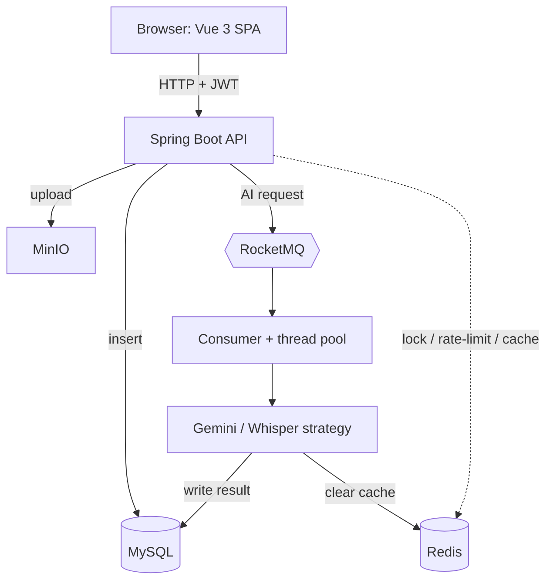

<div align="center">
  <a href="https://github.com/Xiaoc7r/DOVideo-AI">
  </a>

  <h1 align="center">DoVideoAI - Intelligent Video Content Understanding Platform</h1>
  
  <p align="center">
    <strong>End-to-End Asynchronous Processing / Long-Running Task Stability / AI-Powered Q&A </strong>
  </p>

  <p align="center">
    <a href="https://github.com/Xiaoc7r/DOVideo-AI">
      
    </a>
    <a href="https://github.com/Xiaoc7r/DOVideo-AI">
      
    </a>
    <a href="https://github.com/Xiaoc7r/DOVideo-AI">
      
    </a>
    <a href="https://github.com/Xiaoc7r/DOVideo-AI">
      
    </a>
    <a href="https://github.com/Xiaoc7r/DOVideo-AI">
      
    </a>
    <br/>
    <a href="https://github.com/Mingxin-Rao/Ai-intelligence-video-platform/actions/workflows/ci.yml">
      
    </a>
    <a href="loadtest/RESULTS.md">
      
    </a>
    <a href="loadtest/RESULTS.md">
      
    </a>
  </p>
</div>

<br/>

<br/>

**DoVideoAI** is an end-to-end video content understanding platform that integrates user authentication, video upload, audio extraction, and automatic AI summarization.

To address the pain points commonly encountered in video processing scenarios, such as **"long-running blocking operations"**, **"high-concurrency resource contention"**, and **"unstable large-file transfers"**, this project abandons the traditional synchronous processing model and re-architects the system on top of **RocketMQ + Redisson + chunked resumable uploads**.

Every performance claim in this README is measured, with the commands and raw output recorded in [loadtest/RESULTS.md](loadtest/RESULTS.md) — including the cases where the measurement contradicted the original assumption.

The system can connect to large language model APIs, supports custom prompts, and uses Function Calling to enable information lookup and precise summarization.

Most video platforms only solve the problems of "storage" and "playback." DoVideoAI aims to solve the problem of "understanding." It handles long-running tasks through an asynchronous architecture and uses AI to extract core value, so that videos are no longer a black box.

<br/>

## Project Preview

<!-- TODO: Record a short demo (screen recording of upload → async processing → AI summary)
     and drop the GIF/video in here. Replace the line below with:
     
     or, for a video, a link to the uploaded asset. -->

> 🎬 **Demo coming soon** — a short walkthrough GIF will be added here.

<br/>

## Measured Results

Every number below comes from a run that is reproducible from this repository —
the commands, parameters and raw output are in **[loadtest/RESULTS.md](loadtest/RESULTS.md)**.
Nothing here is estimated.

| Area | Result | How it was measured |
|---|---|---|
| **Video-processing latency** | **12.3 s → ~80 ms** response time | Same 5-min 720p input. Async RT via `curl`; the synchronous cost is the service's own `dovideo_ai_task_seconds` timer (FFmpeg + provider round-trip + persistence) |
| **Large-file upload on a degraded link** | **0% → 100%** success | Toxiproxy severing any connection past 8 MiB, 20 MB payload, identical retry budget for both arms |
| **Duplicate upload** | **681.7 ms → 10.8 ms** (~63× faster) | 1 upload + 19 identical repeats; 19/19 deduped, each one also avoiding a paid AI call |
| **Polling read path** | **p50 10.5 ms**, p95 86.2 ms, **0 failures** / 765 requests | k6, ramp to 50 VUs, 3 s think time matching the real SPA poll |
| **Cache effectiveness** | **99.87% hit rate** (762 hits / 1 miss) | Read from the app's own meters after the run above |
| **Test suite** | **120 tests, 0 failures**, ~14 s | JUnit 5 + Mockito + MockWebServer; no middleware required |
| **Coverage** | **76.1% instruction**, 64.6% branch | JaCoCo, enforced as a CI gate |
| **CI pipeline** | **44 s** test job, **2m14s** image build | GitHub Actions on every push and PR |
| **Container image** | **746 MB** | Multi-stage build, verified to contain a working FFmpeg and yt-dlp |

<br/>

##  Core Features

1. 🚀 Stable Upload Experience

**Resumable chunked uploads.** Files are sliced into 5 MiB chunks and the delivered
indices are tracked in a Redis Set keyed by uploader + content hash. A dropped
transfer therefore costs one chunk instead of restarting the file, and because the
key is derived from content rather than from a session, an upload resumes across a
page reload or a client restart. Re-sending a chunk that already landed is absorbed
by the Set, which matters because a weak link is exactly when clients retry blindly.
Merging happens inside object storage, so the bytes never travel back through the
application.

**Instant re-upload.** Content the user already owns is recognised before anything
is transferred, so a repeat upload returns without touching storage — and without
triggering a second paid analysis.

**Immediate response on submit.** Analysis requests return once the task is durably
enqueued in RocketMQ rather than after the work finishes, so the page never sits on
a spinner while FFmpeg and the model run.

2. 🛡️ High-Concurrency Protection

**Distributed lock.** A Redisson lock keyed on the media id, with the WatchDog
renewing it, keeps a double-clicked or concurrently submitted analysis from running
twice — each duplicate run would otherwise cost real provider spend.

**Rate limiting.** A Redisson token-bucket limiter caps analysis dispatch
cluster-wide, so a burst of requests cannot translate into an unbounded API bill.

**Content dedup.** Direct uploads are keyed by MD5 of the bytes; link imports are
keyed by the upstream video id instead, since the same video has many URL forms and
re-encoding changes the bytes. Both collapse to a single stored object and a single
analysis.

3.  🔄 Task Processing Workflow in Detail

**Storage off the app server.** Videos live in MinIO, and FFmpeg reads them straight
from that URL — the application never holds a whole video in memory.

**Asynchronous decoupling.** The controller takes the lock, spends a rate-limit
token, publishes one message and returns. A bounded worker pool drains the queue.

**Retry with backoff.** Provider calls are retried three times with exponential
backoff, and a permanent failure is recorded on the row so the user sees why rather
than watching an endless spinner.

**Observability.** Business metrics (task duration, success rate, queue depth,
rate-limit rejections, cache hit rate) are exported to Prometheus with alert rules
and a Grafana dashboard.

<br/>

## Tech Stack

### Backend

Spring Boot 3 + RocketMQ + Redis (Redisson) + MySQL + MyBatis-Plus + MinIO + FFmpeg + yt-dlp

**AI:** Gemini (summaries) + OpenAI Whisper (transcripts)

### Deployment

Docker (multi-stage build) + Docker Compose · GitHub Actions CI

### Observability & Testing

Spring Boot Actuator + Micrometer → Prometheus + Grafana · JUnit 5 + Mockito + OkHttp MockWebServer · JaCoCo · k6 · Toxiproxy

### Frontend

Vue 3 + Vite + SparkMD5

<br/>

## Quality & Operations

### Tests

```bash
cd server
mvn verify          # 120 tests + JaCoCo report + coverage gate
```

**120 tests, 0 failures, ~14 s, no middleware needed.** Every external dependency
(MySQL, Redis, MinIO, RocketMQ, Gemini, Whisper) is mocked, and the two HTTP provider
clients run against an OkHttp `MockWebServer`, so error paths like 429, malformed
JSON and empty candidates are actually reachable — and the suite costs nothing in
provider spend.

Coverage sits at **76.1% instruction / 64.6% branch**. Lombok-generated accessors are
excluded via `lombok.config`, so the figure reflects hand-written logic rather than
generated boilerplate.

The tests are weighted toward the paths where a regression would be expensive rather
than toward raw coverage:

| Area | What is pinned down |
|---|---|
| Auth | Tampered payload, forged signature, foreign secret and expired tokens are all rejected |
| Authorization | Reading, deleting or analysing another user's media is refused, and the stored object is left untouched |
| Idempotency | A double-click does not publish twice; a re-sent chunk does not corrupt the count |
| Cost control | Rate-limited and lock-contended requests never reach the provider |
| Resumability | `init` reports exactly the missing chunks; `merge` refuses an incomplete set |
| Failure handling | A failed publish rolls back so the task stays retryable; provider errors are returned as values, not thrown, so retries actually trigger |

### CI

[`.github/workflows/ci.yml`](.github/workflows/ci.yml) runs on every push and pull
request:

1. **Build & Test** (~44 s) — JDK 17, tests, JaCoCo report, coverage gate. Coverage
   and a per-class table are published to the run summary.
2. **Docker Image** (~2m14s) — builds the image, reports its size (**746 MB**), and
   asserts that FFmpeg and yt-dlp are actually present and executable inside it. A
   runnable jar with no FFmpeg cannot produce a single summary, so this is checked
   rather than assumed.

The image job is gated on tests passing, so a broken commit never produces an image.

### Observability

```bash
open http://localhost:3001        # Grafana (admin / admin by default)
open http://localhost:9091        # Prometheus
curl localhost:9090/actuator/prometheus
```

Business metrics, not just JVM defaults: task duration histogram, success/failure
counts, retry counts, queue depth, rate-limit rejections, lock contention, dedup
hits and cache hit rate. Alert rules cover task failure rate, queue backlog, p95
task duration and cache-hit-rate collapse.

### Load & failure-injection tests

```bash
BASE_URL=http://localhost:9090 k6 run loadtest/read-path.js
BASE_URL=http://localhost:9090 k6 run loadtest/upload-dedup.js
BASE_URL=http://localhost:9099 k6 run loadtest/weak-network-upload.js   # via Toxiproxy
```

Toxiproxy sits in front of the app so network failure can be injected on demand; the
weak-network test compares monolithic against resumable uploads on a link that
severs long transfers. Full parameters and results in
[loadtest/RESULTS.md](loadtest/RESULTS.md).

<br/>


## Architecture

Two deployables — a **Vue 3 SPA** and a **Spring Boot 3 API** — backed by MySQL, Redis, MinIO, and RocketMQ. The defining idea is **asynchronous decoupling**: expensive AI work is pushed onto RocketMQ and run on a background thread pool, so the HTTP request returns in ~50 ms and the frontend polls for the result.



### Request flow

- **Upload** — `MediaController` stores the file in MinIO, inserts a `media_files` row, and returns immediately.
- **AI summary** — `DebugController` takes a Redisson lock + rate-limit token, publishes to RocketMQ, and returns. `VideoAnalysisConsumer` → `aiTaskExecutor` → `AiService` (with retry) → `GeminiWhisperStrategy` extracts audio via FFmpeg and calls **Gemini**; the summary is saved to MySQL. The frontend polls `/media/list`.
- **Transcript** — same path via `AiService.asyncTranscribe` → **OpenAI Whisper**, producing timestamped text.

### Project structure

```text
doVideo/
├── client/                       # Frontend — Vue 3 + Vite
│   └── src/
│       ├── App.vue               # The entire SPA (UI + all logic)
│       ├── main.js               # Vue bootstrap
│       └── style.css             # Global base styles
│
├── server/                       # Backend — Spring Boot 3 (Java 17)
│   └── src/main/
│       ├── resources/
│       │   └── application.properties   # DB / AI keys / JWT / middleware config
│       └── java/com/example/server/
│           ├── ServerApplication.java   # Entry point
│           ├── config/       # MinioConfig, WebConfig (CORS + interceptor), ThreadPoolConfig
│           ├── controller/   # UserController, MediaController, ChunkUploadController
│           │                 #   (init/chunk/merge), DebugController (AI/transcript/download)
│           ├── interceptor/  # AuthInterceptor (JWT check on /media/**, /debug/**)
│           ├── service/      # AiService (async + retry)
│           ├── consumer/     # VideoAnalysisConsumer (RocketMQ listener)
│           ├── strategy/     # AiAnalysisStrategy + impl/GeminiWhisperStrategy
│           ├── utils/        # GeminiUtils, OpenAiWhisperUtils, MinioUtils,
│           │                 #   YtDlpUtils, JwtUtils, PasswordUtils
│           ├── entity/       # User, MediaFile (MyBatis-Plus table models)
│           ├── mapper/       # UserMapper, MediaFileMapper (BaseMapper CRUD)
│           └── dto/          # AnalysisTaskMsg (RocketMQ message body)
│
├── server/src/test/              # 120 tests — JUnit 5 + Mockito + MockWebServer
│
├── .github/workflows/ci.yml      # CI: test + coverage gate, then image build
├── observability/                # prometheus.yml, alerts.yml, grafana datasource
├── loadtest/                     # k6 scripts + RESULTS.md (all measured numbers)
├── db/init.sql                   # Schema (users, media_files) — auto-run on first MySQL boot
├── rocketmq/broker.conf          # RocketMQ broker config
└── compose.yaml                  # MySQL + Redis + MinIO + RocketMQ (nameserver + broker)
```


<br/>

## My Development Environment 

| Component | Version | Notes |
| :--- | :--- | :--- |
| **JDK** | 21.0.8 | Any version that supports Spring Boot 3 works |
| **Node** | v22.18.0 | Required for the frontend build |
| **MySQL** | 8.0 | Docker image `mysql:8.0` |
| **Redis** | Latest (7.x) | Docker image `redis:latest` |
| **RocketMQ** | 4.9.4 | Docker image `apache/rocketmq:4.9.4` |
| **AI models** | Gemini + OpenAI | Gemini for AI summaries, OpenAI Whisper for transcripts |
| **FFmpeg** | Latest | A post-2025 Snapshot build is recommended |
| **yt-dlp** | Latest | Run `update` regularly to keep the parser library up to date |

<br/>


## How to Deploy Locally

Everything runs in Docker, including the application — one command brings up the
whole stack. Requires Docker Desktop.

### 1. Configure secrets

Secrets are read from `.env`, which is gitignored. Copy the template and fill it in:

```bash
cp .env.example .env
```

| Variable | Required | Notes |
| :--- | :--- | :--- |
| `GEMINI_API_KEY` | ✅ | Google AI Studio key, used for AI summaries |
| `OPENAI_API_KEY` | — | Leave blank to disable "Extract Text" (Whisper) |
| `JWT_SECRET` | ✅ | Long random string, e.g. `openssl rand -base64 48` |
| `MYSQL_PASSWORD`, `MINIO_*` | ✅ | Must match `compose.yaml` (defaults work as-is) |

No key belongs in `application.properties` — every environment-specific value there
is a `${VAR:default}` placeholder, so the same build runs unchanged on the host or in
a container.

Host ports are overridable in `.env` if something already occupies them:
`APP_PORT` (9090), `PROMETHEUS_PORT` (9091), `GRAFANA_PORT` (3001),
`TOXIPROXY_APP_PORT` (9099).

### 2. Start everything

```bash
docker compose up -d --build
```

This builds the application image and starts MySQL, Redis, MinIO, RocketMQ
(NameServer + Broker), Prometheus, Grafana and Toxiproxy. The app waits for MySQL,
Redis and MinIO to report **healthy** before booting, so there is no race on a cold
start. The schema is created automatically on MySQL's first initialization, and the
MinIO bucket is created by the app.

```bash
curl localhost:9090/actuator/health     # {"status":"UP"}
docker compose ps                       # every service healthy
```

| Service | URL |
| :--- | :--- |
| API | http://localhost:9090 |
| MinIO console | http://localhost:9001 (minioadmin / minioadmin) |
| Prometheus | http://localhost:9091 |
| Grafana | http://localhost:3001 (admin / admin) |

### 3. Start the frontend

```bash
cd client
npm install
npm run dev
```

Open the address it prints (http://localhost:5173 by default).

<br/>

### Running the backend on the host instead

Useful for attaching a debugger. The defaults in `application.properties` already
point at the published container ports, so only two things need attention:

1. **Install the native tools** — `brew install ffmpeg yt-dlp` on macOS. Override
   `FFMPEG_DIR` / `YTDLP_PATH` if they are not on Homebrew's default path.
2. **Change `brokerIP1` in `rocketmq/broker.conf` to `127.0.0.1`** and restart the
   broker. The broker advertises that address to the NameServer and clients dial it
   directly, so it must be reachable *from where the app runs*. Leaving it as
   `rmqbroker` makes every publish fail with `No route info of this topic`.

```bash
cd server
mvn spring-boot:run
```

<br/>

## Contributing and Support
If this project helps you, please give it a Star ⭐️⭐️⭐️⭐️⭐️!
