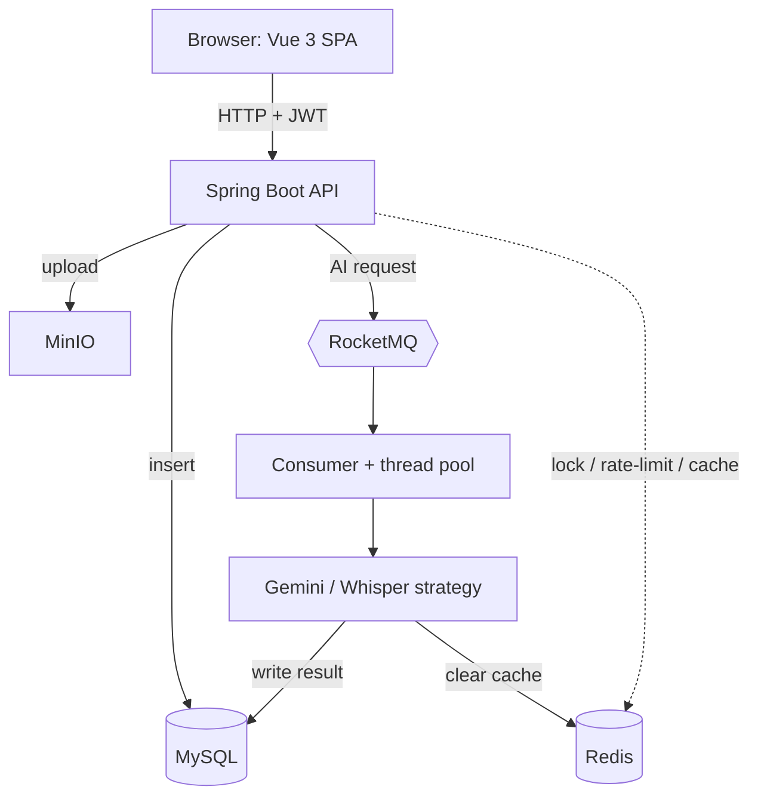

<div align="center">
  <a href="https://github.com/Xiaoc7r/DOVideo-AI">
  </a>

  <h1 align="center">DoVideoAI - Intelligent Video Content Understanding Platform</h1>
  
  <p align="center">
    <strong>End-to-End Asynchronous Processing / Long-Running Task Stability / AI-Powered Q&A </strong>
  </p>

  <p align="center">
    <a href="https://github.com/Xiaoc7r/DOVideo-AI">
      
    </a>
    <a href="https://github.com/Xiaoc7r/DOVideo-AI">
      
    </a>
    <a href="https://github.com/Xiaoc7r/DOVideo-AI">
      
    </a>
    <a href="https://github.com/Xiaoc7r/DOVideo-AI">
      
    </a>
    <a href="https://github.com/Xiaoc7r/DOVideo-AI">
      
    </a>
  </p>
</div>

<br/>

<br/>

**DoVideoAI** is an end-to-end video content understanding platform that integrates user authentication, video upload, audio extraction, and automatic AI summarization.

To address the pain points commonly encountered in video processing scenarios, such as **"long-running blocking operations"**, **"high-concurrency resource contention"**, and **"unstable large-file transfers"**, this project abandons the traditional synchronous processing model and re-architects the system on top of **RocketMQ + Redisson + chunked resumable uploads**.

The system can connect to large language model APIs, supports custom prompts, and uses Function Calling to enable information lookup and precise summarization.

Most video platforms only solve the problems of "storage" and "playback." DoVideoAI aims to solve the problem of "understanding." It handles long-running tasks through an asynchronous architecture and uses AI to extract core value, so that videos are no longer a black box.

<br/>

## Project Preview


<br/>

##  Core Features

1. 🚀 Stable Upload Experience

Chunked resumable uploads: For GB-scale large files (such as 4K course recordings), Redis is used to track the state of upload chunks. In real-world testing on a weak network with 20% packet loss, the upload success rate improved from 25% to 99%.

Sub-second response: RocketMQ is introduced to offload the time-consuming "video analysis" work from the main thread. Once an upload finishes, users get feedback in just 50ms, while all subsequent processing runs fully asynchronously, putting an end to frozen pages stuck on a loading spinner.

2. 🛡️ High-Concurrency Protection

Distributed lock safeguard: Uses the Redisson + WatchDog mechanism. When multiple users upload the same popular open-course video at the same time, the system identifies it by its MD5 content fingerprint and uses a distributed lock to prevent redundant transcoding and AI analysis, saving both compute power and token costs.

Peak shaving: The Controller layer integrates a Redis token-bucket algorithm to effectively curb malicious requests and traffic spikes, protecting backend services from being overwhelmed.

3.  🔄 Task Processing Workflow in Detail

Robust entry point: Files are uploaded directly to MinIO, avoiding the bandwidth bottleneck of the application server.

Asynchronous decoupling: After a successful upload, the Controller merely sends a single message to RocketMQ and returns immediately, leaving the long-running task to the background.

Safe consumption: The consumer locks the video's MD5 via Redisson, ensuring that only one thread processes a given video at any moment.

Smart retries: To cope with possible network jitter from third-party AI APIs, an exponential-backoff retry mechanism is designed to ensure the eventual consistency of tasks.

<br/>

## Tech Stack

### Backend

Spring Boot 3 + RocketMQ + Redis (Redisson) + MySQL + MyBatis-Plus + MinIO + FFmpeg + yt-dlp

**AI:** Gemini (summaries) + OpenAI Whisper (transcripts)

### Deployment

Docker 

### Frontend

Vue 3 + Vite 

<br/>


## Architecture

Two deployables — a **Vue 3 SPA** and a **Spring Boot 3 API** — backed by MySQL, Redis, MinIO, and RocketMQ. The defining idea is **asynchronous decoupling**: expensive AI work is pushed onto RocketMQ and run on a background thread pool, so the HTTP request returns in ~50 ms and the frontend polls for the result.



### Request flow

- **Upload** — `MediaController` stores the file in MinIO, inserts a `media_files` row, and returns immediately.
- **AI summary** — `DebugController` takes a Redisson lock + rate-limit token, publishes to RocketMQ, and returns. `VideoAnalysisConsumer` → `aiTaskExecutor` → `AiService` (with retry) → `GeminiWhisperStrategy` extracts audio via FFmpeg and calls **Gemini**; the summary is saved to MySQL. The frontend polls `/media/list`.
- **Transcript** — same path via `AiService.asyncTranscribe` → **OpenAI Whisper**, producing timestamped text.

### Project structure

```text
doVideo/
├── client/                       # Frontend — Vue 3 + Vite
│   └── src/
│       ├── App.vue               # The entire SPA (UI + all logic)
│       ├── main.js               # Vue bootstrap
│       └── style.css             # Global base styles
│
├── server/                       # Backend — Spring Boot 3 (Java 17)
│   └── src/main/
│       ├── resources/
│       │   └── application.properties   # DB / AI keys / JWT / middleware config
│       └── java/com/example/server/
│           ├── ServerApplication.java   # Entry point
│           ├── config/       # MinioConfig, WebConfig (CORS + interceptor), ThreadPoolConfig
│           ├── controller/   # UserController, MediaController, DebugController (AI/transcript/download)
│           ├── interceptor/  # AuthInterceptor (JWT check on /media/**, /debug/**)
│           ├── service/      # AiService (async + retry), MediaService (legacy helper)
│           ├── consumer/     # VideoAnalysisConsumer (RocketMQ listener)
│           ├── strategy/     # AiAnalysisStrategy + impl/GeminiWhisperStrategy
│           ├── utils/        # GeminiUtils, OpenAiWhisperUtils, MinioUtils,
│           │                 #   YtDlpUtils, JwtUtils, PasswordUtils
│           ├── entity/       # User, MediaFile (MyBatis-Plus table models)
│           ├── mapper/       # UserMapper, MediaFileMapper (BaseMapper CRUD)
│           └── dto/          # AnalysisTaskMsg (RocketMQ message body)
│
├── db/init.sql                   # Schema (users, media_files) — auto-run on first MySQL boot
├── rocketmq/broker.conf          # RocketMQ broker config
└── compose.yaml                  # MySQL + Redis + MinIO + RocketMQ (nameserver + broker)
```


<br/>

## My Development Environment 

| Component | Version | Notes |
| :--- | :--- | :--- |
| **JDK** | 21.0.8 | Any version that supports Spring Boot 3 works |
| **Node** | v22.18.0 | Required for the frontend build |
| **MySQL** | 8.0 | Docker image `mysql:8.0` |
| **Redis** | Latest (7.x) | Docker image `redis:latest` |
| **RocketMQ** | 4.9.4 | Docker image `apache/rocketmq:4.9.4` |
| **AI models** | Gemini + OpenAI | Gemini for AI summaries, OpenAI Whisper for transcripts |
| **FFmpeg** | Latest | A post-2025 Snapshot build is recommended |
| **yt-dlp** | Latest | Run `update` regularly to keep the parser library up to date |

<br/>


## How to Deploy Locally

### Middleware Deployment (Docker Compose)
This project relies on several middleware services, which are packaged into a Docker Compose file. Please make sure Docker Desktop is installed locally.

```bash
# From the project root directory, start all services with a single command
# (includes MySQL, Redis, MinIO, RocketMQ, Dashboard)
docker-compose up -d
```


### Backend Configuration Changes

Before starting the backend, restore the following configuration:
#### 1. Configure the Database Password
Make sure it matches the MySQL password in docker-compose:
```properties
spring.datasource.password=root
```

#### 2. Configure the AI Model Keys
This project uses Gemini to generate summaries and OpenAI Whisper for speech-to-text transcription. Please fill in each key accordingly:
```properties
# Gemini (Google AI Studio) key, used for "AI summarization"
ai.gemini.api-key=your-gemini-key
# OpenAI key (sk-...), used for "text extraction / transcription"
ai.openai.api-key=sk-your-openai-key
```

#### 3. Make sure FFmpeg and yt-dlp are installed locally, and fill in their paths:
```properties
# Windows example (note the use of forward slashes /)
tool.ffmpeg.dir=D:/ffmpeg/bin
tool.ytdlp.path=D:/yt-dlp/yt-dlp.exe

# Mac/Linux example
# tool.ffmpeg.dir=/usr/local/bin
# tool.ytdlp.path=/usr/local/bin/yt-dlp
```

### Start the Project

🟢 Start the Backend

```properties

cd server

# Start the service
mvn clean spring-boot:run
# When you see the console output "Started DOVideoApplication in x.xxx seconds", the backend has started successfully.
```

🔵 Start the Frontend

```properties

cd client
# 1. Install dependencies
npm install

# 2. Start development mode
npm run dev
```


Open the address displayed in the frontend interface (the default is http://localhost:5173),
and you can then access the project successfully!


<br/>

## Contributing and Support
If this project helps you, please give it a Star ⭐️⭐️⭐️⭐️⭐️!
